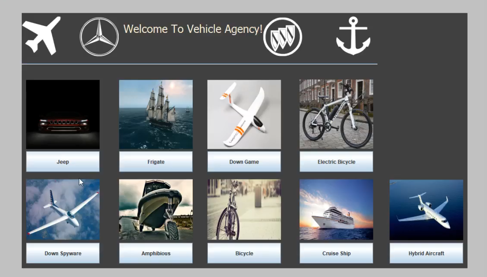

# Vehicles-Agency

In this project I build vehicle agency that have different types of vehicles and variety of functionality for example  to take vehicle for  test drive, buy vehicles, check vehicle history and much more.
The development language is Java and the IDE I worked with is eclipse.
some principles were implemented in the project like Multithreading, Locks synchronization, Design Patterns , OOP and Interfaces. 

### Prerequisites

For run this project you just need go to  Vehicles-Agency/src/Part-2/MainPage.java and run the main page of the project.

